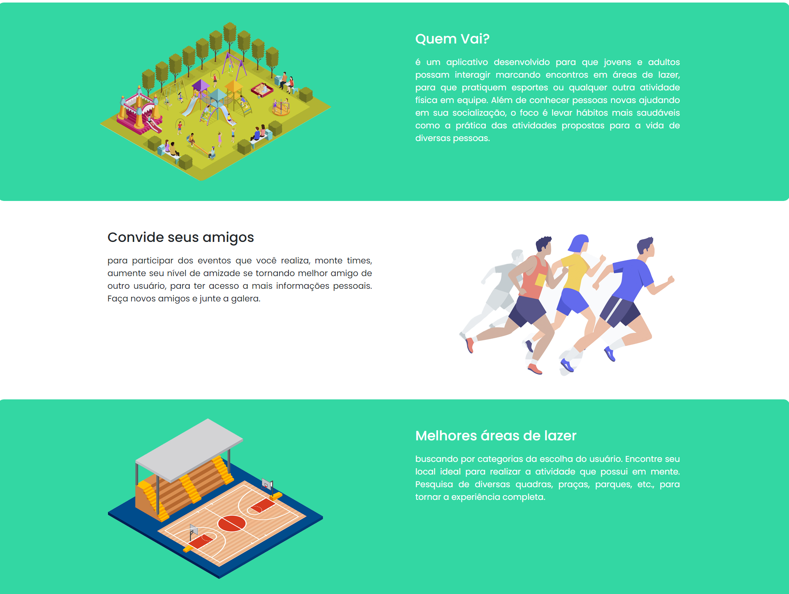
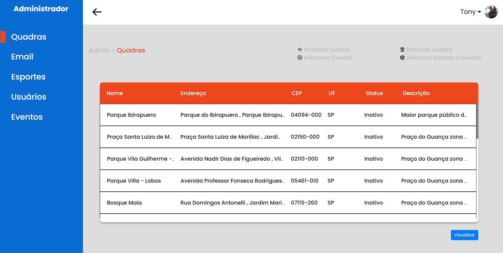
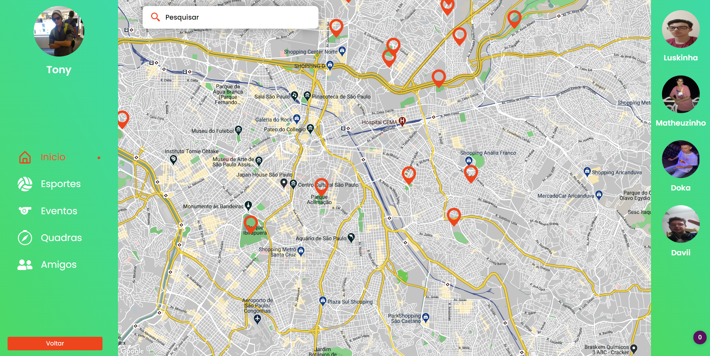

[![Contributors][contributors-shield]][contributors-url]
[![Forks][forks-shield]][forks-url]
[![Stargazers][stars-shield]][stars-url]
[![Issues][issues-shield]][issues-url]
[![LinkedIn][linkedin-shield]][linkedin-url]

<!-- PROJECT LOGO -->
<br />
<p align="center">
  <a href="https://github.com/AntonioGally/QuemVai_Front-End">
    
  </a>

  <h3 align="center">Quem Vai</h3>

  <p align="center">
    Um aplicativo que promove encontros em áreas de lazer pública   <br/> A meeting app in public leisure areas
    <br />
    <a href="https://github.com/AntonioGally/QuemVai_Front-End"><strong> Explore the docs »</strong></a>
    <br />
    <br />
    <a href="https://quemvai.netlify.app/#/">View Demo</a>
    ·
    <a href="https://github.com/AntonioGally/QuemVai_Front-End/issues">Report Bug</a>
    ·
  </p>
</p>

<!-- TABLE OF CONTENTS -->

## Table of Contents

- [About the Project](#about-the-project)
  - [Built With](#built-with)
- [Getting Started](#getting-started)
  - [Prerequisites](#prerequisites)
  - [Installation](#installation)
- [Contributing](#contributing)
- [Contact](#contact)
<!-- ABOUT THE PROJECT -->

## About The Project

<br/>
<br/>
<br/>


Existem vários aplicativos de encontro disponíveis no mercado hoje em dia, mas nós queríamos algo mais. Por meio do aplicativo
Quem Vai, nós democratizamos a busca e o uso de áreas de lazer, ciente que a maior plataforma de mapas que nós temos (google maps)
não nos informa com especificidade todas as áreas de lazer dispníveis nas regiões próximas, e suas características.

O porquê de você usar Quem Vai:

- Praticidade de encontrar praças públicas, quadras públicas, pistas de skate, entre outros
- Você tem o direito de usar e usufruir de todos os locais públicos que lhe convém, se informe :smile:
- Totalmente gratuito e em todas as plataformas digitais

Nossa plataforma ainda está em desenvolvimento, contando com atualizações diárias, vale lembrar que o aplicativo
Quem vai é fruto de um trabalho de conclusão de curso do ensino técnico de informática, na instituição <a href="http://etechoracio.com.br/etec/">ETEC Professor Horácio Augusto da Silveira</a>

### Built With

Aqui está uma lista dos Frameworks e bibliotecas que eu utilizei no projeto

- [React](https://pt-br.reactjs.org)
- [React-Bootstrap](https://react-bootstrap.github.io)
- [Bootstrap](https://getbootstrap.com)
- [React-Hook-Form](https://react-hook-form.com)
- [Axios](https://github.com/axios/axios)
- [Date-Fns](https://date-fns.org/v2.16.1/docs/Locale)
- [React-Google-Maps]()

<!-- GETTING STARTED -->

## Getting Started

Para executar o aplicativo localmente na sua máquina, é recomendável o uso do software VS Code, o mesmo usado
no desenvolvimento. Aqui está uma lista de procedimentos passo a passo para baixar, instalar e executar o aplicativo:

### Prerequisites

Esteja ciente que é necessário uma chave da <a href="https://console.cloud.google.com/apis/library?folder=&organizationId=&project=quem-vai-6868">Google Maps API</a> <b>válida</b>. Mais específicamente, a API chamada <b>Maps JavaScript API</b><br/>
Necessário:

- <a href="https://git-scm.com/downloads">Git Bash</a>
- <a href="https://nodejs.org/en/download/">Node js</a>

### Installation

1. Clone o Repositório

```sh
git clone https://github.com/AntonioGally/QuemVai_Front-End.git
```

2. Abra a pasta clonada no Vs Code

```sh
code ./QuemVai_Front-End
```

3. Instale as dependências do projeto

```sh
yarn install
```

4. Inicialize o projeto

```sh
yarn start
```
5. Entre na pasta GoogleMaps, tanto no Mobile quanto no Desktop e coloque sua chave

```sh
cd src/Desktop/components/GoogleMaps/KeyFolder/GoogleKey.tsx
cd src/Mobile/components/GoogleMaps/KeyFolder/GoogleKey.tsx
```

<!-- ROADMAP -->

<!-- CONTRIBUTING -->

## Contributing

As contribuições são o que torna a comunidade de código aberto um lugar incrível para aprender, inspirar e criar. Quaisquer contribuições que você fizer serão ** muito apreciadas **.

1. Fork o projeto
2. Crie sua branch com uma nova funcionalidade (`git checkout -b feature/MinhaFuncionalidade`)
3. Commit suas mudanças (`git commit -m 'adicionando alguma funcionalidade'`)
4. Faça upload para sua branch (`git push origin feature/MinhaFuncionalidade`)
5. Abra um Pull Request

<!-- CONTACT -->

## Contact

Antônio Lima Gally Neto - antonio.gally@gmail.com

Link do Projeto: [https://github.com/AntonioGally/QuemVai_Front-End](https://github.com/AntonioGally/QuemVai_Front-End)

<!-- ACKNOWLEDGEMENTS -->

<!-- MARKDOWN LINKS & IMAGES -->
<!-- https://www.markdownguide.org/basic-syntax/#reference-style-links -->

[contributors-shield]: https://img.shields.io/github/contributors/AntonioGally/QuemVai_Front-End.svg?style=flat-square
[contributors-url]: https://github.com/AntonioGally/QuemVai_Front-End/graphs/contributors
[forks-shield]: https://img.shields.io/github/forks/AntonioGally/QuemVai_Front-End.svg?style=flat-square
[forks-url]: https://github.com/AntonioGally/QuemVai_Front-End/network/members
[stars-shield]: https://img.shields.io/github/stars/AntonioGally/QuemVai_Front-End.svg?style=flat-square
[stars-url]: https://github.com/AntonioGally/QuemVai_Front-End/stargazers
[issues-shield]: https://img.shields.io/github/issues/AntonioGally/QuemVai_Front-End.svg?style=flat-square
[issues-url]: https://github.com/AntonioGally/QuemVai_Front-End/issues

<!-- [license-shield]: https://img.shields.io/github/license/AntonioGally/QuemVai_Front-End.svg?style=flat-square
[license-url]: https://github.com/AntonioGally/QuemVai_Front-End/blob/master/LICENSE.txt -->

[linkedin-shield]: https://img.shields.io/badge/-LinkedIn-black.svg?style=flat-square&logo=linkedin&colorB=555
[linkedin-url]: https://www.linkedin.com/in/antônio-gally-089bab180/
[product-screenshot]: https://github.com/AntonioGally/QuemVai_Front-End/blob/AplicationWeb/src/img/AppPresentation.gif
